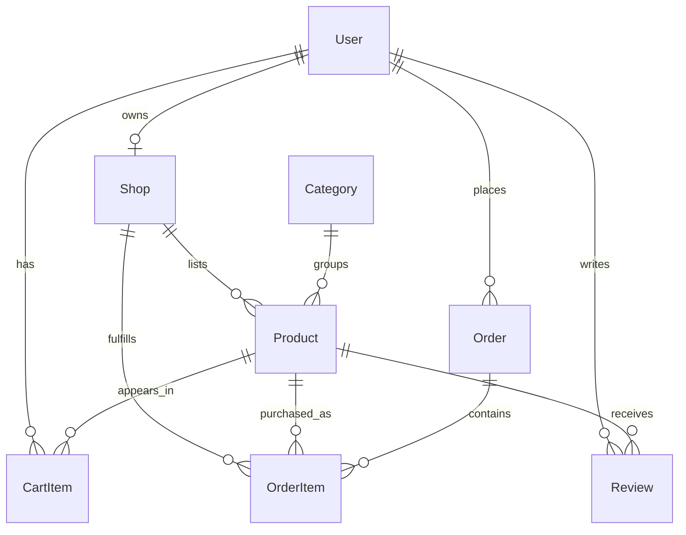

# SellerHub Marketplace Database Design v0.1

## 1. 文档定位

这份文档是 SellerHub Marketplace 的数据库设计文档，不是最终实现代码。

它要先解决五个问题：

1. 系统有哪些核心实体（entity）。
2. 实体之间是什么关系（relationship）。
3. 哪些字段由用户输入，哪些字段由系统计算。
4. 哪些业务流程必须使用事务（transaction）。
5. Prisma schema 初稿应该如何表达这些业务规则。

本项目的数据库设计目标不是“把页面需要的数据存起来”，而是支撑一个可以用于求职展示的 marketplace 系统。重点是让 buyer、seller、admin 三类角色的业务边界清楚，让商品、购物车、订单、库存之间的数据关系可解释、可测试、可扩展。

---

## 2. 设计结论

SellerHub Marketplace 的 MVP 使用 PostgreSQL 关系型数据库。

核心实体是：

| 实体 | 作用 |
|---|---|
| User | 表示平台账号，承载 buyer、seller、admin 角色 |
| Shop | 表示 seller 拥有的店铺 |
| Category | 表示商品分类 |
| Product | 表示店铺上架的商品 |
| CartItem | 表示用户购物车中的商品项 |
| Order | 表示买家提交的一次订单 |
| OrderItem | 表示订单中的具体商品快照 |
| Review | 表示买家对商品的评价，MVP 可选 |

最关键的设计结论：

1. `OrderItem` 必须保存下单时的商品价格，不能只引用 `Product.priceCents`。
2. `Order.totalCents` 必须由后端根据数据库中的商品价格计算，不能信任前端传来的总价。
3. `CartItem` 和 `OrderItem` 不能混用；购物车是临时意图，订单项是历史事实。
4. 商品删除优先使用 `ARCHIVED` 状态，不建议物理删除已经被订单引用的商品。
5. 下单流程必须使用事务，至少要保证订单创建、订单项创建、库存扣减、购物车清空保持一致。
6. seller 权限必须通过 `Shop.ownerId` 间接验证，不能只相信前端传来的 `shopId`。

---

## 3. 核心业务关系总览

### 3.1 高层关系

```txt
User 1 -> 0..1 Shop
Shop 1 -> many Product
Category 1 -> many Product
User 1 -> many CartItem
Product 1 -> many CartItem
User 1 -> many Order
Order 1 -> many OrderItem
Product 1 -> many OrderItem
Shop 1 -> many OrderItem
User 1 -> many Review
Product 1 -> many Review
```

### 3.2 业务解释

一个 `User` 可以是 buyer、seller 或 admin。MVP 阶段通过单个 `role` 字段区分角色。

一个 seller 最多拥有一个 `Shop`。这个限制可以降低 MVP 复杂度，同时仍然能展示 seller dashboard、product management、order management 的核心能力。

一个 `Shop` 可以拥有多个 `Product`。商品必须属于一个店铺，也必须属于一个分类。

一个 buyer 可以拥有多个 `CartItem`。同一个 buyer 对同一个 product 在购物车里只能有一条记录，通过数量字段 `quantity` 表示购买数量。

一个 buyer 可以创建多个 `Order`。每个 `Order` 下面有多个 `OrderItem`。`OrderItem` 是订单历史快照，保存下单时的商品名、单价、数量、小计和店铺 ID。

---

## 4. Entity Relationship Overview



这个 ERD 只表达核心关系，不表达所有字段。

---

## 5. Money 字段设计

### 5.1 结论

MVP 使用整数分（cents）存储金额：

```txt
priceCents
unitPriceCents
subtotalCents
totalCents
```

不使用 JavaScript `number` 的小数金额作为数据库核心金额字段。

### 5.2 原因

JavaScript 的 `number` 是 IEEE 754 double，不能精确表示所有十进制小数。对于金额系统，使用小数直接计算容易出现精度误差。

错误方向：

```txt
price = 19.99
subtotal = price * quantity
```

推荐方向：

```txt
priceCents = 1999
subtotalCents = priceCents * quantity
```

前端展示时再格式化：

```txt
1999 -> "$19.99"
```

### 5.3 规则

- `Product.priceCents` 表示商品当前价格。
- `OrderItem.unitPriceCents` 表示下单时的单价快照。
- `OrderItem.subtotalCents` 等于 `unitPriceCents * quantity`。
- `Order.totalCents` 等于所有 `OrderItem.subtotalCents` 的总和。
- 前端可以传 checkout intention，但不能传可信的最终价格。

---

## 6. User Model

### 6.1 技术意义

`User` 是身份（identity）和角色（role）的基础。它不直接表示店铺，也不直接表示订单项的 seller 权限。seller 权限要通过 `Shop.ownerId` 和相关资源关系推导。

### 6.2 字段设计

| 字段 | 类型 | 必填 | 来源 | 说明 |
|---|---|---:|---|---|
| id | string | Yes | system | 用户主键 |
| name | string | Yes | user input | 显示名称 |
| email | string | Yes | user input | 登录邮箱，唯一 |
| passwordHash | string | Yes | system | 密码哈希，不返回给前端 |
| role | enum | Yes | system/admin | BUYER / SELLER / ADMIN |
| createdAt | DateTime | Yes | system | 创建时间 |
| updatedAt | DateTime | Yes | system | 更新时间 |

### 6.3 约束

| 约束 | 原因 |
|---|---|
| `email` unique | 防止多个账号使用同一邮箱登录 |
| `passwordHash` never selected by default in response | 防止敏感字段泄漏 |
| `role` controlled by backend | 防止前端注册时伪造 admin |

### 6.4 常见错误

错误：把 `role` 完全交给注册表单。

问题：用户可以通过修改 request body 注册成 admin。

正确做法：MVP 可以允许用户选择 buyer 或 seller，但 admin 只能由 seed data 或后台脚本创建。

---

## 7. Shop Model

### 7.1 技术意义

`Shop` 是 seller 业务能力的边界。seller 是否能创建商品、查看订单、更新订单状态，都应该通过 shop ownership 判断。

### 7.2 字段设计

| 字段 | 类型 | 必填 | 来源 | 说明 |
|---|---|---:|---|---|
| id | string | Yes | system | 店铺主键 |
| ownerId | string | Yes | system | 店铺所有者，指向 User |
| name | string | Yes | user input | 店铺名称 |
| slug | string | Yes | system/user input | URL 友好标识 |
| description | string | No | user input | 店铺介绍 |
| logoUrl | string | No | user input/system | 店铺 logo |
| status | enum | Yes | system/admin | ACTIVE / SUSPENDED |
| createdAt | DateTime | Yes | system | 创建时间 |
| updatedAt | DateTime | Yes | system | 更新时间 |

### 7.3 约束

| 约束 | 原因 |
|---|---|
| `ownerId` unique | MVP 阶段一个 seller 只能拥有一个 shop |
| `slug` unique | 支持稳定的店铺 URL |
| `status` controls seller actions | suspended 店铺不能新增商品 |

### 7.4 权限规则

- 只有 seller 可以创建 shop。
- seller 只能编辑自己的 shop。
- admin 可以 suspend shop。
- suspended shop 仍可被查看，但不能创建新商品。

### 7.5 常见错误

错误：只在前端隐藏 `Edit Shop` 按钮。

问题：用户仍然可以直接请求后端 API。

正确做法：后端通过 `shop.ownerId === currentUser.id` 验证 ownership。

---

## 8. Category Model

### 8.1 技术意义

`Category` 用于组织商品列表、筛选商品、支撑导航和 admin 管理。

### 8.2 字段设计

| 字段 | 类型 | 必填 | 来源 | 说明 |
|---|---|---:|---|---|
| id | string | Yes | system | 分类主键 |
| name | string | Yes | admin input | 分类名称 |
| slug | string | Yes | admin input/system | URL 友好标识 |
| createdAt | DateTime | Yes | system | 创建时间 |
| updatedAt | DateTime | Yes | system | 更新时间 |

### 8.3 约束

| 约束 | 原因 |
|---|---|
| `name` unique | 避免重复分类 |
| `slug` unique | 支持 URL query 和稳定链接 |

### 8.4 删除规则

MVP 建议：如果分类已经被商品引用，不允许删除。

原因：如果删除分类，会导致商品分类为空或历史筛选逻辑混乱。

可选替代方案：增加 `isActive` 字段，让分类可以停用但不删除。

---

## 9. Product Model

### 9.1 技术意义

`Product` 是 marketplace 的核心交易对象。它代表当前可浏览和可购买的商品状态，但不代表历史订单事实。

### 9.2 字段设计

| 字段 | 类型 | 必填 | 来源 | 说明 |
|---|---|---:|---|---|
| id | string | Yes | system | 商品主键 |
| shopId | string | Yes | system | 所属店铺 |
| categoryId | string | Yes | seller input | 所属分类 |
| name | string | Yes | seller input | 商品名称 |
| slug | string | Yes | system/seller input | 商品 URL 标识 |
| description | string | Yes | seller input | 商品描述 |
| priceCents | Int | Yes | seller input | 当前商品价格，单位 cents |
| stock | Int | Yes | seller input/system | 当前库存 |
| imageUrl | string | No | seller input/system | 商品图片 |
| status | enum | Yes | seller/admin | DRAFT / ACTIVE / ARCHIVED |
| createdAt | DateTime | Yes | system | 创建时间 |
| updatedAt | DateTime | Yes | system | 更新时间 |

### 9.3 约束

| 约束 | 原因 |
|---|---|
| `priceCents > 0` | 商品价格必须为正数 |
| `stock >= 0` | 库存不能为负数 |
| `shopId + slug` unique | 同一店铺内商品 URL 不重复 |
| `status` indexed | 商品列表经常按 active 状态筛选 |

### 9.4 商品状态

| 状态 | 说明 |
|---|---|
| DRAFT | 草稿，seller 可编辑，买家不可见 |
| ACTIVE | 上架，买家可见且可购买 |
| ARCHIVED | 归档，买家不可购买 |

### 9.5 删除策略

MVP 不建议直接硬删除 product。推荐删除操作实际改成：

```txt
Product.status = ARCHIVED
```

原因：订单历史需要继续引用商品。即使商品下架，历史订单仍然要展示下单时的商品信息。

### 9.6 常见错误

错误：订单详情页直接读取当前 `Product.priceCents`。

问题：如果 seller 后来修改价格，历史订单金额会变化。

正确做法：订单详情展示 `OrderItem.unitPriceCents` 和 `OrderItem.productName` 快照。

---

## 10. CartItem Model

### 10.1 技术意义

`CartItem` 表示用户购买意图，但它不是订单。购物车数据可以变化，可以被库存变化影响，也可以因为商品下架而失效。

### 10.2 字段设计

| 字段 | 类型 | 必填 | 来源 | 说明 |
|---|---|---:|---|---|
| id | string | Yes | system | 购物车项主键 |
| userId | string | Yes | system | 所属用户 |
| productId | string | Yes | user action | 商品 ID |
| quantity | Int | Yes | user input | 购买数量 |
| createdAt | DateTime | Yes | system | 创建时间 |
| updatedAt | DateTime | Yes | system | 更新时间 |

### 10.3 约束

| 约束 | 原因 |
|---|---|
| `userId + productId` unique | 同一商品在购物车中只出现一次 |
| `quantity > 0` | 数量必须为正数 |

### 10.4 业务规则

- 加入购物车时，如果 item 已存在，增加数量。
- 更新数量时不能超过当前库存。
- 商品下架后，购物车项可以保留，但 checkout 时必须失败或要求移除。
- 购物车 total 由当前商品价格计算，只表示当前预估金额，不是历史事实。

### 10.5 常见错误

错误：把购物车 total 存在数据库中并长期依赖。

问题：商品价格或数量变化后 total 容易失真。

正确做法：购物车 total 在读取购物车时根据当前 `Product.priceCents` 和 `CartItem.quantity` 计算。

---

## 11. Order Model

### 11.1 技术意义

`Order` 表示一次 checkout 产生的订单。它是历史事实，不应该随着商品当前信息变化而改变核心金额。

### 11.2 字段设计

| 字段 | 类型 | 必填 | 来源 | 说明 |
|---|---|---:|---|---|
| id | string | Yes | system | 订单主键 |
| buyerId | string | Yes | system | 下单用户 |
| status | enum | Yes | system/seller | 订单整体状态 |
| paymentStatus | enum | Yes | system | 支付状态，MVP 为 mock |
| totalCents | Int | Yes | system | 订单总价，后端计算 |
| shippingName | string | Yes | user input | 收货人 |
| shippingPhone | string | Yes | user input | 收货电话 |
| shippingAddress | string | Yes | user input | 收货地址 |
| createdAt | DateTime | Yes | system | 创建时间 |
| updatedAt | DateTime | Yes | system | 更新时间 |

### 11.3 订单状态

| 状态 | 说明 |
|---|---|
| PENDING | 订单已创建，等待 mock payment |
| PAID | mock payment 成功 |
| PROCESSING | 卖家处理中 |
| SHIPPED | 已发货 |
| COMPLETED | 已完成 |
| CANCELLED | 已取消 |

### 11.4 paymentStatus

| 状态 | 说明 |
|---|---|
| PENDING | 尚未支付或 mock payment 未完成 |
| PAID | mock payment 成功 |
| FAILED | mock payment 失败 |

### 11.5 业务规则

- `totalCents` 必须由后端计算。
- checkout request 可以传 shipping information，但不能传可信 total。
- 创建订单后，购物车应清空。
- buyer 只能查看自己的订单。
- seller 不直接拥有 Order，而是通过 OrderItem 的 `shopId` 查看相关订单。

---

## 12. OrderItem Model

### 12.1 技术意义

`OrderItem` 是整个数据库设计中最重要的实体之一。它把“当前商品”转换成“历史购买记录”。

### 12.2 字段设计

| 字段 | 类型 | 必填 | 来源 | 说明 |
|---|---|---:|---|---|
| id | string | Yes | system | 订单项主键 |
| orderId | string | Yes | system | 所属订单 |
| productId | string | Yes | system | 被购买商品 |
| shopId | string | Yes | system | 下单时所属店铺 |
| productName | string | Yes | system snapshot | 下单时商品名 |
| productImageUrl | string | No | system snapshot | 下单时商品图片 |
| quantity | Int | Yes | system | 购买数量 |
| unitPriceCents | Int | Yes | system snapshot | 下单时单价 |
| subtotalCents | Int | Yes | system | 小计 |
| status | enum | Yes | system/seller | 该商品项履约状态 |
| createdAt | DateTime | Yes | system | 创建时间 |
| updatedAt | DateTime | Yes | system | 更新时间 |

### 12.3 为什么要保存 snapshot 字段

`OrderItem.productName`、`OrderItem.productImageUrl`、`OrderItem.unitPriceCents` 都是历史快照。

如果只通过 `productId` 关联当前 Product，会出现三个问题：

1. 商品改名后，历史订单名称被动变化。
2. 商品改价后，历史订单金额被动变化。
3. 商品归档后，历史订单详情可能无法正常展示。

订单是历史事实，必须保存下单当时的关键展示信息。

### 12.4 OrderItem status

| 状态 | 说明 |
|---|---|
| PENDING | 等待卖家处理 |
| PROCESSING | 卖家处理中 |
| SHIPPED | 已发货 |
| COMPLETED | 已完成 |
| CANCELLED | 已取消 |

### 12.5 多商家订单处理

MVP 允许一个订单包含多个店铺的商品。seller dashboard 不直接按 Order 所有权查询，而是按 `OrderItem.shopId` 查询。

这意味着：

```txt
Buyer sees one order.
Seller sees the order items that belong to their shop.
```

这种设计比“一个订单只能有一个店铺”更接近 marketplace，同时比引入 `ShopOrder` 表更简单。

### 12.6 后期扩展

如果后期要支持更复杂的多商家履约，可以增加：

```txt
ShopOrder
  -> groups order items by shop
  -> owns seller-level shipping status
  -> owns seller-level tracking number
```

MVP 暂时不引入，避免过度设计。

---

## 13. Review Model

### 13.1 结论

`Review` 是 MVP 可选实体。第一版可以先不做，但数据库设计保留扩展方向。

### 13.2 字段设计

| 字段 | 类型 | 必填 | 来源 | 说明 |
|---|---|---:|---|---|
| id | string | Yes | system | 评论主键 |
| userId | string | Yes | system | 评论用户 |
| productId | string | Yes | user action | 被评论商品 |
| rating | Int | Yes | user input | 1 到 5 |
| comment | string | No | user input | 评论内容 |
| status | enum | Yes | system/admin | VISIBLE / HIDDEN |
| createdAt | DateTime | Yes | system | 创建时间 |
| updatedAt | DateTime | Yes | system | 更新时间 |

### 13.3 业务规则

- 同一用户对同一商品只能评论一次。
- 后期可以限制只有购买过商品的 buyer 才能评论。
- admin 可以隐藏评论。

---

## 14. Enum Design

### 14.1 Role

```txt
BUYER
SELLER
ADMIN
```

### 14.2 ShopStatus

```txt
ACTIVE
SUSPENDED
```

### 14.3 ProductStatus

```txt
DRAFT
ACTIVE
ARCHIVED
```

### 14.4 OrderStatus

```txt
PENDING
PAID
PROCESSING
SHIPPED
COMPLETED
CANCELLED
```

### 14.5 PaymentStatus

```txt
PENDING
PAID
FAILED
```

### 14.6 OrderItemStatus

```txt
PENDING
PROCESSING
SHIPPED
COMPLETED
CANCELLED
```

### 14.7 ReviewStatus

```txt
VISIBLE
HIDDEN
```

---

## 15. Index and Unique Constraint Design

### 15.1 Unique constraints

| Model | Constraint | 原因 |
|---|---|---|
| User | `email` | 登录唯一身份 |
| Shop | `ownerId` | MVP 一个 seller 一个 shop |
| Shop | `slug` | 店铺 URL 唯一 |
| Category | `name` | 避免重复分类 |
| Category | `slug` | 分类 URL/query 唯一 |
| Product | `shopId + slug` | 同一店铺内商品 slug 唯一 |
| CartItem | `userId + productId` | 购物车同商品只保留一条 |
| Review | `userId + productId` | 同一用户同一商品只评论一次 |

### 15.2 Indexes

| Model | Index | 原因 |
|---|---|---|
| Product | `status` | 公开商品列表只查 active |
| Product | `categoryId` | 分类筛选 |
| Product | `shopId` | 店铺商品列表 |
| Product | `createdAt` | 最新商品排序 |
| Product | `priceCents` | 价格排序和筛选 |
| CartItem | `userId` | 获取当前用户购物车 |
| Order | `buyerId` | buyer 订单列表 |
| Order | `status` | 订单状态筛选 |
| OrderItem | `shopId` | seller 查看店铺订单项 |
| OrderItem | `status` | seller 按履约状态筛选 |
| Review | `productId` | 商品评论列表 |

---

## 16. Transaction Requirements

## 16.1 Create Order Transaction

创建订单必须使用事务。

流程：

```txt
1. Read current user cart items.
2. Verify cart is not empty.
3. Load products with shop and category.
4. Verify each product is ACTIVE.
5. Verify each product shop is ACTIVE.
6. Verify stock is enough for every item.
7. Calculate totalCents on the backend.
8. Create Order.
9. Create OrderItem records with snapshots.
10. Decrease Product.stock.
11. Clear CartItem records.
12. Return created order.
```

### 16.1.1 为什么必须事务

如果没有事务，可能出现：

| 失败点 | 后果 |
|---|---|
| 创建 Order 成功，创建 OrderItem 失败 | 空订单 |
| 创建 OrderItem 成功，扣库存失败 | 订单和库存不一致 |
| 扣库存成功，清空购物车失败 | 用户重复下单风险 |
| 两个用户同时购买最后一个库存 | 超卖 |

### 16.1.2 库存扣减规则

库存扣减不能只做普通读取后更新：

```txt
read stock
if stock >= quantity
update stock
```

因为并发请求可能同时读到相同库存。

更安全的方向是使用条件更新：

```txt
update product
set stock = stock - quantity
where id = productId and stock >= quantity
```

如果 affected rows 为 0，说明库存不足或商品状态已变化。

Prisma 中可以用 transaction 加 `updateMany` 条件更新，再检查 `count`。

---

## 17. Authorization-related Data Rules

### 17.1 Seller ownership

seller 是否能操作 product，应通过数据库关系判断：

```txt
Product -> Shop -> ownerId
```

规则：

```txt
currentUser.id must equal product.shop.ownerId
```

不能只检查：

```txt
request.body.shopId
```

因为 request body 可以被用户伪造。

### 17.2 Seller order access

seller 是否能查看订单项，应通过：

```txt
OrderItem.shopId -> Shop.ownerId
```

规则：

```txt
currentUser.id must equal orderItem.shop.ownerId
```

### 17.3 Admin access

admin 权限必须通过后端认证上下文判断：

```txt
currentUser.role === ADMIN
```

前端 route guard 只能改善用户体验，不能作为安全边界。

---

## 18. System-calculated Fields

以下字段不能由前端直接决定：

| 字段 | 计算位置 | 原因 |
|---|---|---|
| `passwordHash` | backend | 必须 hash 原始密码 |
| `Order.totalCents` | backend | 防止前端篡改总价 |
| `OrderItem.unitPriceCents` | backend | 必须来自当前 Product |
| `OrderItem.subtotalCents` | backend | 必须由单价和数量计算 |
| `OrderItem.productName` | backend | 下单时商品快照 |
| `OrderItem.shopId` | backend | 必须来自 Product.shopId |
| `createdAt` | database/backend | 系统时间 |
| `updatedAt` | database/backend | 系统时间 |
| `role = ADMIN` | seed/admin script | 防止普通用户伪造 |

---

## 19. Prisma Schema Draft

下面是 Prisma schema 初稿。它用于表达数据库结构方向，实际实现时还需要结合项目目录、migration 策略、seed data 和 API 需求微调。

```prisma
generator client {
  provider = "prisma-client-js"
}

datasource db {
  provider = "postgresql"
  url      = env("DATABASE_URL")
}

enum Role {
  BUYER
  SELLER
  ADMIN
}

enum ShopStatus {
  ACTIVE
  SUSPENDED
}

enum ProductStatus {
  DRAFT
  ACTIVE
  ARCHIVED
}

enum OrderStatus {
  PENDING
  PAID
  PROCESSING
  SHIPPED
  COMPLETED
  CANCELLED
}

enum PaymentStatus {
  PENDING
  PAID
  FAILED
}

enum OrderItemStatus {
  PENDING
  PROCESSING
  SHIPPED
  COMPLETED
  CANCELLED
}

enum ReviewStatus {
  VISIBLE
  HIDDEN
}

model User {
  id           String     @id @default(cuid())
  name         String
  email        String     @unique
  passwordHash String
  role         Role       @default(BUYER)
  createdAt    DateTime   @default(now())
  updatedAt    DateTime   @updatedAt

  shop      Shop?
  cartItems CartItem[]
  orders    Order[]
  reviews   Review[]
}

model Shop {
  id          String     @id @default(cuid())
  ownerId     String     @unique
  name        String
  slug        String     @unique
  description String?
  logoUrl     String?
  status      ShopStatus @default(ACTIVE)
  createdAt   DateTime   @default(now())
  updatedAt   DateTime   @updatedAt

  owner      User        @relation(fields: [ownerId], references: [id], onDelete: Restrict)
  products   Product[]
  orderItems OrderItem[]

  @@index([status])
}

model Category {
  id        String    @id @default(cuid())
  name      String    @unique
  slug      String    @unique
  createdAt DateTime  @default(now())
  updatedAt DateTime  @updatedAt

  products Product[]
}

model Product {
  id          String        @id @default(cuid())
  shopId      String
  categoryId  String
  name        String
  slug        String
  description String
  priceCents  Int
  stock       Int
  imageUrl    String?
  status      ProductStatus @default(DRAFT)
  createdAt   DateTime      @default(now())
  updatedAt   DateTime      @updatedAt

  shop       Shop        @relation(fields: [shopId], references: [id], onDelete: Restrict)
  category   Category    @relation(fields: [categoryId], references: [id], onDelete: Restrict)
  cartItems  CartItem[]
  orderItems OrderItem[]
  reviews    Review[]

  @@unique([shopId, slug])
  @@index([shopId])
  @@index([categoryId])
  @@index([status])
  @@index([createdAt])
  @@index([priceCents])
}

model CartItem {
  id        String   @id @default(cuid())
  userId    String
  productId String
  quantity  Int
  createdAt DateTime @default(now())
  updatedAt DateTime @updatedAt

  user    User    @relation(fields: [userId], references: [id], onDelete: Cascade)
  product Product @relation(fields: [productId], references: [id], onDelete: Restrict)

  @@unique([userId, productId])
  @@index([userId])
  @@index([productId])
}

model Order {
  id              String        @id @default(cuid())
  buyerId          String
  status          OrderStatus   @default(PENDING)
  paymentStatus   PaymentStatus @default(PENDING)
  totalCents      Int
  shippingName    String
  shippingPhone   String
  shippingAddress String
  createdAt       DateTime      @default(now())
  updatedAt       DateTime      @updatedAt

  buyer User        @relation(fields: [buyerId], references: [id], onDelete: Restrict)
  items OrderItem[]

  @@index([buyerId])
  @@index([status])
  @@index([paymentStatus])
  @@index([createdAt])
}

model OrderItem {
  id               String          @id @default(cuid())
  orderId          String
  productId        String
  shopId           String
  productName      String
  productImageUrl  String?
  quantity         Int
  unitPriceCents   Int
  subtotalCents    Int
  status           OrderItemStatus @default(PENDING)
  createdAt        DateTime        @default(now())
  updatedAt        DateTime        @updatedAt

  order   Order   @relation(fields: [orderId], references: [id], onDelete: Cascade)
  product Product @relation(fields: [productId], references: [id], onDelete: Restrict)
  shop    Shop    @relation(fields: [shopId], references: [id], onDelete: Restrict)

  @@index([orderId])
  @@index([productId])
  @@index([shopId])
  @@index([status])
}

model Review {
  id        String       @id @default(cuid())
  userId    String
  productId String
  rating    Int
  comment   String?
  status    ReviewStatus @default(VISIBLE)
  createdAt DateTime     @default(now())
  updatedAt DateTime     @updatedAt

  user    User    @relation(fields: [userId], references: [id], onDelete: Cascade)
  product Product @relation(fields: [productId], references: [id], onDelete: Cascade)

  @@unique([userId, productId])
  @@index([productId])
  @@index([status])
}
```

---

## 20. Prisma Schema Limitations

Prisma schema 可以表达很多结构约束，但不是所有业务规则都能只靠 schema 完成。

### 20.1 需要应用层校验的规则

| 规则 | 原因 |
|---|---|
| `priceCents > 0` | Prisma schema 不一定覆盖所有 check constraint 工作流 |
| `stock >= 0` | 需要 request validation 和事务更新保护 |
| `quantity > 0` | 需要 API 层校验 |
| seller 只能管理自己的 product | 需要 auth context 和 ownership query |
| 下单时 product 必须 ACTIVE | 需要 service 层业务校验 |
| suspended shop 不能新增商品 | 需要 service 层业务校验 |
| totalCents 必须等于 items subtotal 总和 | 需要后端计算和事务保证 |

### 20.2 可选数据库级增强

后期可以通过 raw SQL migration 添加 check constraints：

```sql
ALTER TABLE "Product" ADD CONSTRAINT "Product_priceCents_positive" CHECK ("priceCents" > 0);
ALTER TABLE "Product" ADD CONSTRAINT "Product_stock_non_negative" CHECK ("stock" >= 0);
ALTER TABLE "CartItem" ADD CONSTRAINT "CartItem_quantity_positive" CHECK ("quantity" > 0);
ALTER TABLE "OrderItem" ADD CONSTRAINT "OrderItem_quantity_positive" CHECK ("quantity" > 0);
```

MVP 可以先在 Zod validation 和 service 层保证这些规则，后期再加数据库级 check constraints。

---

## 21. Query Patterns

## 21.1 Public product list

需求：展示 active products，支持搜索、分类、价格排序、分页。

核心查询条件：

```txt
Product.status = ACTIVE
Shop.status = ACTIVE
optional categoryId
optional search keyword
optional price range
order by createdAt or priceCents
skip/take pagination
```

### 21.2 Seller product list

需求：seller dashboard 查看自己的商品。

核心查询条件：

```txt
Product.shop.ownerId = currentUser.id
optional status
order by updatedAt desc
```

### 21.3 Buyer cart

需求：用户查看购物车。

核心查询：

```txt
CartItem.userId = currentUser.id
include Product
include Product.shop
```

读取后计算：

```txt
itemSubtotalCents = product.priceCents * cartItem.quantity
cartTotalCents = sum(itemSubtotalCents)
```

### 21.4 Buyer order list

需求：buyer 查看自己的订单。

核心查询：

```txt
Order.buyerId = currentUser.id
include OrderItem
order by createdAt desc
```

### 21.5 Seller order dashboard

需求：seller 查看自己店铺相关订单项。

核心查询：

```txt
OrderItem.shop.ownerId = currentUser.id
include Order
include Product
order by createdAt desc
```

---

## 22. Seed Data Requirements

MVP seed data 至少包含：

| 数据 | 数量 |
|---|---:|
| admin user | 1 |
| buyer user | 1 |
| seller users | 2 |
| shops | 2 |
| categories | 3 |
| active products | 12 |
| draft products | 2 |
| archived products | 1 |
| cart items | 2 |
| orders | 3 |
| order items | 5 |

### 22.1 Demo accounts

```txt
Buyer:
  email: buyer@sellerhub.dev
  password: Password123

Seller:
  email: seller@sellerhub.dev
  password: Password123

Admin:
  email: admin@sellerhub.dev
  password: Password123
```

seed script 中必须 hash password，不能把明文密码写入 `passwordHash`。

---

## 23. Common Modeling Mistakes

| 错误 | 为什么错 | 正确做法 |
|---|---|---|
| Order 只保存 productId，不保存价格快照 | 商品改价会影响历史订单 | OrderItem 保存 `unitPriceCents` |
| 前端传 totalCents，后端直接保存 | 用户可以篡改价格 | 后端根据数据库价格计算 total |
| Product 硬删除 | 历史订单无法可靠展示 | 使用 `ARCHIVED` 状态 |
| CartItem 复用为 OrderItem | 购物车是临时状态，订单是历史事实 | checkout 时创建 OrderItem snapshot |
| seller 权限只看 request body 的 shopId | body 可以伪造 | 通过 Product -> Shop -> ownerId 查询 |
| 只靠前端 route guard 做权限 | API 仍可被直接调用 | 后端 middleware 和 service 都检查 |
| 库存先读后写，没有事务 | 并发下可能超卖 | transaction + conditional update |
| 用浮点数保存价格 | 小数计算可能不精确 | 使用 integer cents |
| 一个 boolean 表示商品是否可见 | 状态不可扩展 | 使用 ProductStatus enum |
| 分类被商品引用时直接删除 | 商品数据关系断裂 | 使用 restrict 或 inactive 状态 |

---

## 24. Interview Explanation Checklist

项目完成后，必须能清楚解释这些问题：

1. 为什么 marketplace 需要 `Shop`，而不是只在 `Product` 上放 `sellerId`。
2. 为什么 seller 权限要通过 `Shop.ownerId` 判断。
3. 为什么 `OrderItem` 要保存 product snapshot。
4. 为什么金额用 `priceCents`，不用小数。
5. 为什么 cart total 不长期存数据库。
6. 为什么 checkout 不能信任前端传来的 total。
7. 为什么创建订单必须使用 transaction。
8. 如何避免两个用户同时购买最后一个库存。
9. 为什么 Product 删除用 `ARCHIVED`，而不是 hard delete。
10. 为什么 seller 查看订单要查 `OrderItem.shopId`。
11. 为什么 `Order` 和 `OrderItem` 都有 status。
12. 哪些规则靠数据库约束，哪些规则靠 service 层校验。
13. TypeScript 类型检查和 Zod runtime validation 分别解决什么问题。
14. Prisma schema 能表达什么，不能表达什么。
15. 以后如果支持多个 shop per seller，需要改哪些地方。

---

## 25. 后续文档衔接

完成这份 database design 后，下一步应该写：

```txt
docs/architecture/sellerhub-api-contract.md
```

API contract 要基于本数据库设计继续确定：

1. 每个 endpoint 的 request params、query、body。
2. 每个 endpoint 的 response shape。
3. 每个 endpoint 的 auth requirement。
4. 每个 endpoint 的 validation schema。
5. 每个 endpoint 触发哪些数据库查询或事务。
6. 前端 feature modules 如何调用这些 API。

不要在 API contract 里重新发明数据模型。API contract 必须服从 database design。

---

## 26. 最终记忆模型

SellerHub 的数据库设计可以记成一条主线：

```txt
User owns identity and role.
Shop owns seller business boundary.
Product owns current sellable item state.
CartItem owns temporary purchase intention.
Order owns checkout history.
OrderItem owns immutable purchase snapshot.
```

最重要的工程分界是：

```txt
Current state:
  Product
  CartItem

Historical fact:
  Order
  OrderItem
```

最重要的安全分界是：

```txt
Frontend can request an action.
Backend must verify identity, role, ownership, input, stock, and price.
Database must preserve relationships and history.
```
